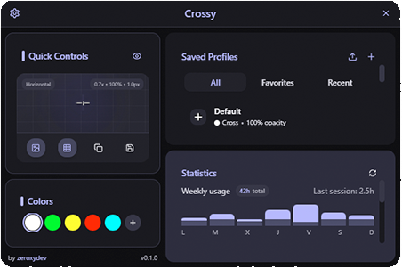
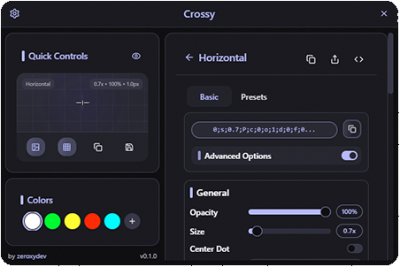
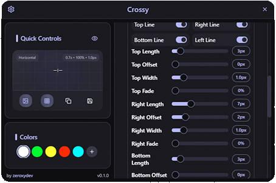
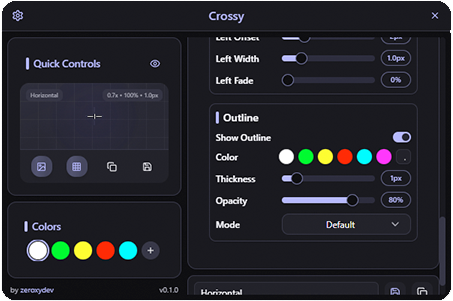
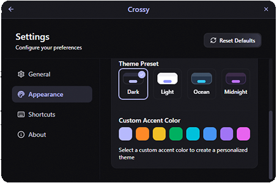
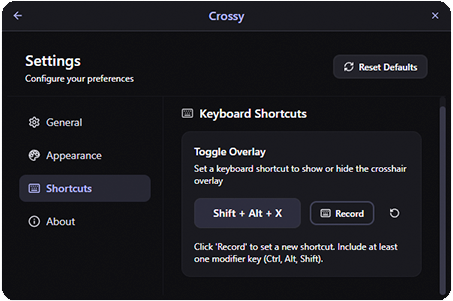

<!-- PROJECT SHIELDS -->
[![Releases][releases-shield]][releases-url]
[![Discord][discord-shield]][discord-url]
[![Twitter Follow][twitter-shield]][twitter-url]
[![Donate][donate-shield]][donate-url]

<!-- PROJECT LOGO -->
 

  

  <h3 align="center">Crossy | Customizable Crosshair Overlay</h3>

  

    A powerful and highly customizable crosshair overlay for any game or application
     
    <a href="https://github.com/ZeroxyDev/crossy/issues">Report Bug</a>
    ·
    <a href="https://github.com/ZeroxyDev/crossy/issues">Request Feature</a>
    ·
    <a href="https://discord.gg/zeroxydev">Discord</a>
  

<!-- TABLE OF CONTENTS -->

  
Table of Contents

  <ol>
    <li><a href="#about-crossy">About Crossy</a></li>
    <li><a href="#key-features">Key Features</a></li>
    <li>
      <a href="#getting-started">Getting Started</a>
      <ul>
        <li><a href="#prerequisites">Prerequisites</a></li>
        <li><a href="#installation">Installation</a></li>
      </ul>
    </li>
    <li><a href="#customization">Customization</a></li>
    <li><a href="#technology">Technology</a></li>
    <li><a href="#license">License</a></li>
    <li><a href="#contact">Contact</a></li>
  </ol>

<!-- ABOUT THE PROJECT -->
## About Crossy

Crossy is a powerful crosshair overlay that works with any game or application. Whether you're playing an FPS that doesn't have crosshair customization or need precision targeting in other applications, Crossy provides a solution that's both highly customizable and incredibly lightweight.

  

Crossy was built with performance in mind, using Rust for the backend to ensure minimal system resource usage while gaming. The clean, minimal interface stays out of your way, with comprehensive customization options for when you need them.

(<a href="#readme-top">back to top</a>)

<!-- KEY FEATURES -->
## Key Features

* **Highly Customizable Crosshairs** - Create the perfect crosshair for your needs
  - Adjust size, opacity, color, shape, and style
  - Fine-tune every detail for maximum precision
  - Unlimited crosshair designs

* **Multiple Theme Support**
  - Choose from pre-made themes or create your own
  - Light and dark modes with custom accent colors
  - Personalize the entire application appearance

* **Import/Export System**
  - Share your crosshair designs with others
  - Import crosshairs from the community
  - Backup your favorite designs

* **Usage Statistics**
  - Track which crosshairs you use most
  - Monitor usage time per game
  - Performance insights

* **Profile Management**
  - Create different profiles for different games
  - Quick switching between profiles
  - Automatic profile activation based on active application

* **Clean, Minimalist Interface**
  - Distraction-free design
  - Intuitive controls
  - Focus on functionality

* **Quick Control System**
  - Rapidly change crosshair colors and properties
  - On-the-fly adjustments during gameplay
  - Instant preview of changes

* **Global Shortcut Support**
  - Toggle overlay visibility with customizable shortcuts
  - Switch between profiles with keyboard
  - Adjust opacity and size without opening the app

* **Optimized Performance**
  - Built with Rust for high performance and low resource usage
  - Minimal impact on game performance
  - Lightweight and efficient

(<a href="#readme-top">back to top</a>)

<!-- GETTING STARTED -->
## Getting Started

Getting started with Crossy is quick and simple.

### Prerequisites

* Windows 10 or higher, macOS, or Linux

### Installation

1. Download the latest version of Crossy from the [releases page](https://github.com/ZeroxyDev/crossy/releases)
2. Run the installer
3. Launch Crossy from your desktop or start menu

When running the installer of Crossy application, you may encounter a message indicating that the **application is not signed**. This is a common occurrence for unsigned software. Follow these steps to proceed securely:

1. Upon seeing the "application not signed" message, click on "More Info."
2. Look for the option that allows you to continue or run the application despite the lack of a digital signature.
3. Click on "Run Anyway" to initiate the application safely.

This message is a standard security caution, and by following these steps, you can confidently launch the Crossy application.

(<a href="#readme-top">back to top</a>)

<!-- USAGE -->
## Usage

Using Crossy is straightforward:

1. Launch Crossy
2. Design your crosshair or select from presets
3. Use the global shortcut (default: Ctrl+Alt+X) to toggle the overlay
4. Enjoy a customized crosshair in any game or application

### Crosshair Editor Workflow

Crossy's editor provides a step-by-step process to create your perfect crosshair:

  
<strong>Step 1:</strong> Start with a basic crosshair template

  
  
  
<strong>Step 2:</strong> Adjust parameters to refine your design

  
  
  
<strong>Step 3:</strong> Fine-tune colors and details for the perfect result

  

Crossy runs silently in your system tray when minimized. Click the tray icon to open the interface anytime you want to adjust settings.

### Quick Tips:

- **For most games**: Crossy works out of the box with no special configuration
- **For fullscreen games**: Consider using borderless windowed mode for best results
- **For competitive games**: Check if using external crosshairs is permitted by the game's terms of service

(<a href="#readme-top">back to top</a>)

<!-- CUSTOMIZATION -->
## Customization

Crossy offers extensive customization options:

### Crosshair Editor
The built-in editor allows you to create custom crosshairs by adjusting:
- Shape (dot, cross, circle, square, and more)
- Size and thickness
- Color and opacity
- Gap and spread
- Outline and dot options

### Themes
Change the appearance of the application with:
- Light and dark modes
- Custom accent colors
- Background opacity and blur
- Interface scaling

  

### Shortcuts
Configure keyboard shortcuts for:
- Toggling the overlay
- Switching between profiles (in the future)
- Increasing/decreasing opacity (in the future)
- Quick color changes (in the future)

  

(<a href="#readme-top">back to top</a>)

<!-- TECHNOLOGY -->
## Technology

Crossy is built with cutting-edge technology to provide maximum performance with minimal resource usage:

- **Rust Backend**: Ensures high performance, reliability, and efficient memory usage
- **Tauri Framework**: Delivers lightweight, secure, and cross-platform compatibility
- **React & TypeScript**: Creates a responsive and type-safe user interface
- **Tailwind CSS**: Provides a clean, consistent, and customizable design system

This technology stack allows Crossy to run efficiently in the background while you game, with negligible impact on your system's performance.

(<a href="#readme-top">back to top</a>)

<!-- LICENSE -->
## License

Crossy is proprietary software. All rights reserved.

© zeroxydev. Unauthorized copying, modification, distribution, or use of this software is strictly prohibited.

(<a href="#readme-top">back to top</a>)

<!-- CONTACT -->
## Contact

ZeroxyDev - [@ZeroxyDev](https://x.com/ZeroxyDev)

Project Link: [https://github.com/ZeroxyDev/crossy](https://github.com/ZeroxyDev/crossy)

(<a href="#readme-top">back to top</a>)

<!-- MARKDOWN LINKS & IMAGES -->
[releases-shield]: https://img.shields.io/github/v/release/zeroxydev/crossy?include_prereleases&style=for-the-badge
[releases-url]: https://github.com/ZeroxyDev/crossy/releases
[discord-shield]: https://img.shields.io/discord/123456789?color=5865F2&label=discord&logo=discord&logoColor=white&style=for-the-badge
[discord-url]: https://discord.gg/zeroxydev
[twitter-shield]: https://img.shields.io/twitter/follow/zeroxydev?style=for-the-badge&logo=x&color=000000&labelColor=000000&label=Follow&logoColor=white
[twitter-url]: https://x.com/zeroxydev
[donate-shield]: https://img.shields.io/badge/$-donate-ff69b4.svg?style=for-the-badge
[donate-url]: https://ko-fi.com/zeroxydev

